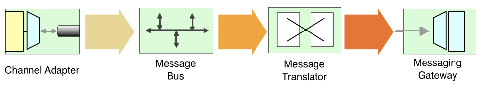
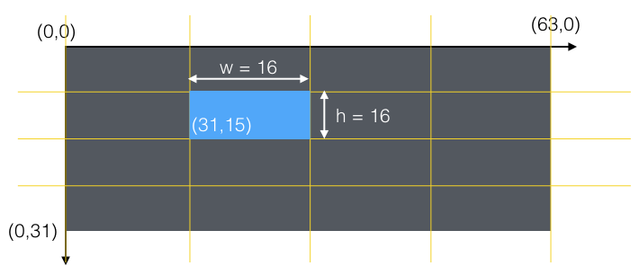

PURPOSE
================

This project intends to give a complete tool to display various information coming from IoT on a pixel panel powered by 
a Raspberry Pi. The goal is to be very flexible yet very simple to layout information as well as grab data from various
sources.

This project relies on:
* HARDWARE
  + A Raspberry Pi 3 Model B (other raspberry models are supported, see below)
  + A Adafruit HAT although this is not [mandatory](https://github.com/hzeller/rpi-rgb-led-matrix/tree/master/adapter)
* SOFTWARE
  + [the excellent RGB Matrix library from Henner Zeller](https://github.com/hzeller/rpi-rgb-led-matrix). This library 
  allows to control commonly available 32x32 or 16x32 RGB LED panels with the 
  Raspberry Pi. Can support PWM up to 11Bit per channel, providing true 24bpp 
  color with CIE1931 profile. We use the python binding provided by the library. 
  Please note that its tested with python 2.7. At the time we tested it was not working 
  properly with python 3. Also note that all APIs from C++ are not bound and the python API is a bit poorer 
  but it remains sufficient for the purpose of this project.

  
The NEOLED project is (c) NEOPIXL SA <contact@neopixl.com>, licensed with
[GNU General Public License Version 2.0](http://www.gnu.org/licenses/gpl-2.0.txt)
(which means, if you use it in a product somewhere, you need to make the
source and all your modifications available to the receiver of such product so
that they have the freedom to adapt and improve).
  
All Raspberry Pi versions supported
-----------------------------------

This supports the old Raspberry Pi's Version 1 with 26 pin header and also the
B+ models, the Pi Zero, as well as the Raspberry Pi 2 and 3 with 40 pins.
The 26 pin models can drive one chain of RGB panels, the 40 pin models
**up to three** chains in parallel (each chain 12 or more panels long).

The Raspberry Pi 2 and 3 are faster than older models (and the Pi Zero) and
sometimes the cabeling can't keep up with the speed; check out
this [troubleshooting section](#help-some-pixels-are-not-displayed-properly)
what to do.

The [Raspbian Lite][raspbian-lite] distribution is recommended.

Types of Displays
-----------------
There are various types of displays that come all with the same Hub75 connector.
They vary in the way the multiplexing is happening.

Type  | Scan Multiplexing | Program Option               | Remark
-----:|:-----------------:|:-----------------------------|-------
64x64 |  1:32             | --led-rows=64 --led-chain=2  | For displays with E line.
32x32 |  1:16             | --led-rows=32                |
32x64 |  1:16             | --led-rows=32 --led-chain=2  | internally two chained 32x32
16x32 |  1:8              | --led-rows=16                |
?     |  1:4              | --led-rows=8                 | (not tested myself)

These can be chained by connecting the output of one panel to the input of
the next panel. You can chain quite a few together.

The 64x64 matrixes typically have 5 address lines (A, B, C, D, E). There are
also 64x64 panels out there that only seem to have 1:4 multiplexing (there
is A and B), but I have not had these in my lab yet to test.

QUICKSTART
==========

Once you've checked the project, please ensure that you've properly checked out the matrix submodule : 

> git submodule update --init --recursive

You will have to compile everything. Please make sure that you've setup the makefile by editing the lib/Makefile file [as explained in the matrix library documentation](https://github.com/hzeller/rpi-rgb-led-matrix/blob/master/README.md)

```shell
cd matrix
sudo apt-get update && sudo apt-get install python2.7-dev python-pillow -y
make build-python
sudo make install-python
```

Install as a system service
---------------------------
Installing as a system service as many advantages, the first one being to have the program to tied to the tty in which you launched it. 
The second is certainly to not having to manually start the program each time the device is rebooted.
The service definition must be on the /lib/systemd/system folder. The file will be named neoled.service

> sudo vi /lib/systemd/system/neoled.service

Here's what you should type in that file:

```
[Unit]
Description=NEOLED service
After=multi-user.target
 
[Service]
Type=simple
ExecStart=/usr/bin/python /home/pi/neopixl-led/neoled.py -f /path/to/your/config/file
RestartSec=1min
Restart=on-failure
 
[Install]
WantedBy=multi-user.target
```
Now that we have our service we need to activate it:

```
sudo chmod 644 /lib/systemd/system/neoled.service
chmod +x /home/pi/neopixl-led/neoled.py
sudo systemctl daemon-reload
sudo systemctl enable neoled.service
sudo systemctl start neoled.service
```
If we want to check the status of our service, you can execute:

> sudo systemctl status neoled.service

And in general, here are the commands that you might find useful. The last one is particularly useful if nothing gets displayed on the matrix. 
There might be a miconfiguration or a bug and this will give you the system out of the python interpreter. 

```
# Start service
sudo systemctl start neoled.service
 
# Stop service
sudo systemctl stop neoled.service
 
# Check service's log
sudo journalctl -f -u neoled.service
```

For more information please see [the wiki](https://wiki.archlinux.org/index.php/systemd).

GENERAL CONCEPTS
================

If you are not interested in the conception of the library, you can simply skip this section.

The main purpose was :
* get information from various sources (shell scripts, http webhooks, ...) that we call data providers here after 
* represent these information on the led matrix using various representations/widgets such as text widget, graphs, colored squares, progress bars and so on
* have a great flexibility to layout the widgets and make them listen to any data provider
* have all this easily extensible 
* have all this easily configurable

For these reasons, we decided to have an efficient pattern in mind: Enterprise Integration Patterns or EIP for short. 
If you are not familiar with this, it's not a problem at all. If you are curious you can visit the [EIP web site](http://www.enterpriseintegrationpatterns.com/).

So back to our EIP, we wanted to cleanly separate data sources (that we call data providers) and their representation (widgets) 
so that any data source can be represented in many different ways (even several times simultaneously).

#### data providers

Data providers can be physical objects coming from the IoT or more complex systems such as servers or even cloud hosted apps, SAAS or however you call it. 

Providers can be either active or passive. An active provider triggers information update by itself. 
It can be for example a webhook on a SAAS system such as Github. A passive provider addresses information that we periodically need to ask for and is therefore based on a scheduler.

Each time a data provider has a new data to provide, it emits a pubsub message on a very simple message bus. It's up to any component to consume this message and do whatever it needs with it. 
The most obvious usage is of course to display the information using a graphical widget. To make this work, you have to know what you consume as an information. This is done by simply naming the message you emit or consume.

#### adapters

Eventually a data provider may have information not properly formatted for display so you want to transform it before it can be consumed by others. 

This is done using adapters.
 
An adapter is a message consumer that consumes a message, extracts the payload and emit a new message. 
<br>To illustrate this, let's say you want to display a clock and the only provider that you have configured is providing you 
with a date and time string. You have to create a regexp or any other parsing to extract the time of the string outputted by the provider. The adapter does this.

In the end this is what you finally came up with using EIP notation:



#### commands

When you are part of the IoT, you may be interested in listening to information produced by others or you may want to command other objects. For the second case, we have... well... commands. 
 
A command is specific to the hardware or system it drives. 
For example, a hue command can only drive a Philips Hue bridge and send on/off or color commands. 
A command can listen to events, just as widgets do. 
It then interprets the message payload to get information and drive the outbound component.

#### layouts

Layouts are not part of the bus in itself and they play no role here. They are simply there to gather widgets together 
so that you can easily switch from one group of widgets to the other. 

Let's say for example that you have a layout for ordinary information like a clock and from time to time you want to 
display the amount of issues in your bug tracking system with the resolution duration. 
You have to switch from the clock layout to a more complex layout that uses text widgets, colored squares and so on. 
You define each layout and ask the system to switch from one to the other.  

This is basically what you need to know about the general concepts. Additionally we have added two handy  

Config
------

The config file is a JSON file that has the following sections:

* matrix: configuration of the led matrix hardware
* layouts: the different widget layouts. A layout defines how widgets are arranged on the full matrix size.
* defaultLayout: specifies the layout that must be loaded by default when the program starts the first time.
* providers: configuration of the data providers (our source of information)
* adapters: configuration of adapters of information
* commands: configuration of the commands that can be sent to various hardware (currently Philips Hue and WeMo switches are supported)

the config file can be passed as a command line option using the -f flag. By default it will use the config file located in ```sample-config``` folder.

### Matrix

this configuration allows you to setup your rgb matrix layout.

* **rows**: Panel rows. 8, 16, 32 or 64. (Default: 32).
* **chain**: Number of daisy-chained panels. (Default: 1).
* **parallel**: For A/B+ models or RPi2,3b: parallel chains. range=1..3 (Default: 1).
* **pwmbits**: PWM bits (Default: 11).<br>
* **brightness**: Brightness in percent (Default: 100).

```
"matrix": {
    "rows": 32,
    "parallel": 1,
    "chain": 4,
    "pwmbits": 11,
    "brightness": 50
}
```

### Layouts

list of layout files used.`Paths are relative to neoled root folder.

```
"layouts": [
    "sample-config/layout1.json",
    "sample-config/layout2.json",
    "sample-config/layout3.json"
]]
```
You can specify which layout should be loaded by default using the ```defaultLayout``` property (which defaults to 0, the first layout of the array) 

>"defaultLayout": 0

A layout file is maybe the most difficult config file to setup. Below is a complete description on how to set it up.

A layout file is an array of widget components to display. You can choose any widget from:

* BidibulleWidget: a neopixl thingy :) a small space invader like (5x5 pixel character). 
* GraphWidget: a bar graph
* ImageWidget: an image 
* ProgressBarWidget: a progress bar
* SquareWidget: a filled square
* TextWidget: a multi-line text

For each widget that you want to use you have to specify:

* x: position in the x axis. 0 is the left most border of the led panel.
* y: position in the y axis. Beware that 0 is the upper border of the led panel and increasing values are when you get down.
* width: width in pixels 
* height: height in pixels

To ease things a bit, here is how you can compute x, y, w and h



optionally you can specify:

* borderColor: a string containing a RGB hex value such as 0xAA00FF. Border width is always one pixel.
* backgroundColor: : a string containing a RGB hex value such as 0xAA00FF

a value of zero for these properties simply prevents neoled from drawing it.

Each widget listens to the data he has to display using the ```listen``` property.
 
There are two specific tricks about the widgets. 

The first one is that you may want to quickly extract information from a message if it's a JSON payload. 
In that case you would have to write an adapter which is a bit tedious. Instead you can use the jsonpath property to specify json path expressions:

```
"jsonpath": [
  "web.hockey",
  "feedback.name"
]
```

The second trick is the color tweaker. The color tweaker allows you to tweak the color of a widget in reaction to some input values. 
It works thanks to two properties: color_choosers and observe. You can set one or more observers on a property. 

An observer specifies three things grouped in a tuple:

* the property that is observed
* the color chooser
* the targeted color property to be modified

to be observable, a property must be explicitly marked with a ```@color_tweaker`` on its setter.`
the color property to be modified must be a property that stores a color.

as an example : 

```
[
  "text",
  0,
  "_bgColor"
]
```

this observer listens any change made on the text property of the TextWidget. 
It evaluates the impact on the color thanks to the color chooser at index 0.
The color that is changed is the bgColor. Please note that we specify directly the ivar and not the property name here.

The color chooser is an array of tuples. Each tuple specifies:

* an operator (=,<,>,>= or <=)
* the right side of the comparison
* a color

For each tuple, the observed property is compared to the second element of the tuple using the operator. If the comparison evaluates to true, the color will be applied to the target property.
The first matching condition wins.

Let's see a complete example:

```
"color_choosers": [
      [
        [
          "=",
          "yvan",
          "0xFF0000"
        ],
        [
          "=",
          "fabrice",
          "0x00FF00"
        ],
        [
          "=",
          "axel",
          "0x0000FF"
        ]
      ],
      [
        [
          "=",
          "yvan",
          "0xAAAA00"
        ],
        [
          "=",
          "fabrice",
          "0x00AAAA"
        ],
        [
          "=",
          "axel",
          "0xAA00AA"
        ]
      ]
    ],
    "observe": [
      [
        "text",
        0,
        "_bgColor"
      ],
      [
        "text",
        1,
        "_color"
      ]
    ]
```

Here we define two observers. 
The first one listens to the text property of the widget using the first color chooser and it will have an impact on the background color of the widget.
The second one listens to the text property of the widget using the second color chooser. It will have an impact on the text color.
 
Why all this complex stuff? Because it can be useful to change a text color in red if a value is critical for instance.
Here is another example:

```
{
    "type": "widgets.SquareWidget.SquareWidget",
    "x": 91,
    "y": 14,
    "width": 4,
    "height": 4,
    "borderColor": "0",
    "listen": "dummy.event",
    "color_choosers": [
      [
        [
          ">",
          "6",
          "0xFF0000"
        ],
        [
          ">",
          "3",
          "0x00FF00"
        ],
        [
          ">",
          "0",
          "0x0000FF"
        ]
      ]
    ],
    "observe": [
      [
        "val",
        0,
        "_color"
      ]
    ]
  }
```

This square widget changes its tint based on the value it receives.
 
* If it's more than 6: the square is red, 
* between 3 and 6: it's green, 
* less than 3: it's blue. 

### Providers

Providers, adapters and commands are configured using arrays of json objects.

Each provider can have a different number of parameters, depending on its specificity. Available providers are:

* **CpuProvider**: provides the CPU used
* **DatetimeProvider**: provides clock
* **RandomProvider**: provides a random number
* **RollingCounterProvider**: provides a number that increments from ```lowerBound``` (default is 0) until ```upperBound``` (default is 10) and rolls back to lowerBound. The increment step cann be specified using the ```step``` property which defaults to 1
* **ShellProvider**: executes a shell command and returns the standard output.
* **WebProvider**: emits an event based on the url called and the body.

For providers, adapters and commands, the ```type``` is mandatory. It specifies the python module name containing the code to run this component. 

For providers, you should specify the name of the event that is emitted using the ```emit``` property.
For passive providers, you should specify the frequency at which the provider is queried using the ```refreshInterval``` property. 

To illustrate the configuration of a provider here is a simple example:

```
{
  "type": "providers.RollingCounterProvider.RollingCounterProvider",
  "refreshInterval": 5,
  "lowerBound": 0,
  "upperBound": 2,
  "emit": "layout.event"
}
```

#### web provider

The web provider has some particularities that are explained here. The web provider starts a web server that accepts http calls on port 8080.

Basically it accepts two kind of http requests : GET and POST.

For every requests received, it will emit a message names web.+ the first path component of the url. For instance if it receives a call at ```http://<yourIP>:8080/layout``` it will emit an event named ```web.layout```.
For both GET and POST requests it will send the URL path and query parameters. For POST requests it will also send the request body

| variable name | content                                 |
| ------------- |-----------------------------------------| 
| path          | the path of the url                     |
| query         | the query params                        |
| body          | the request body if it's a POST request |

### adapters

adapters are similar to providers except that they listen to events and emit events. So they should specify both ```listen``` and ```emit``` properties.

available adapters:

* bidibulle: a neopixl specials :) it allows to specify a small space invader like (5x5 pixel character) to display. This information is extracted from a web service call url. To test it, simply make a call to http://<neoled-ip>/bidibulle/<bidibulle-name>
* hue: extracts values of hue, saturation and brightness from an HTTP call to tweak lights operated by a Philips Hue Bridge.
* jenkins: incomplete
* layout: extract the layout to display from an HTTP call URL. To test it, simply make a call to http://<neoled-ip>/layout/<layout-position-in-the-layouts-array> 

```
{
  "type": "adapters.layout.LayoutAdapter",
  "listen": "web.layout",
  "emit": "layout.event"
}
```

### commands

commands are similar to providers and adapters. All their parameters are specific to the object to which they talk.

```
{
  "type": "commands.hue.HueCommand",
  "bridgeIp": "192.168.136.56",
  "config_file_path": "/home/pi/neopixl-led/sample-config/confighue",
  "listen": "hue.command",
  "lightbulbs": [
    "Porte",
    "Plafond 1"
  ]
}
```

#### More about the bidibulle widget

A bidibulle is a 5x5 pixel grid. To represent it, we need a 25bits bit field. We draw it line by line starting from the bottom 
right and going from right to left. Each time a pixel must be drawn we use a 1 else 0. This is then grouped/represented in Hexadecimal.

Illustration:

This bidibulle
```
X   X     
 XXX 
X X X
XXXXX
 X X 
```
 
as we encode from bottom to top it must be read as (the same be mirrored vertically and horizontally):
 
```
 X X     -->  01010
XXXXX    -->  11111
X X X    -->  10101
 XXX     -->  01110
X   X    -->  10001
```

will be encoded as: 0x11757EA

```
   line5 line4 line3 line2 line1
   ~~~~~ +++++ ~~~~~ +++++ ~~~~~
...10001 01110 10101 11111 01010
```

grouped differently (
```
...1 0001 0111 0101 0111 1110 1010
   1    1    7    5    7    E    A
```

